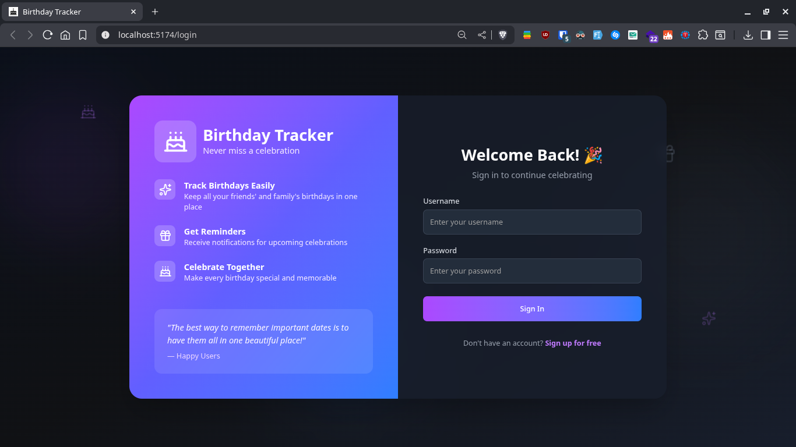
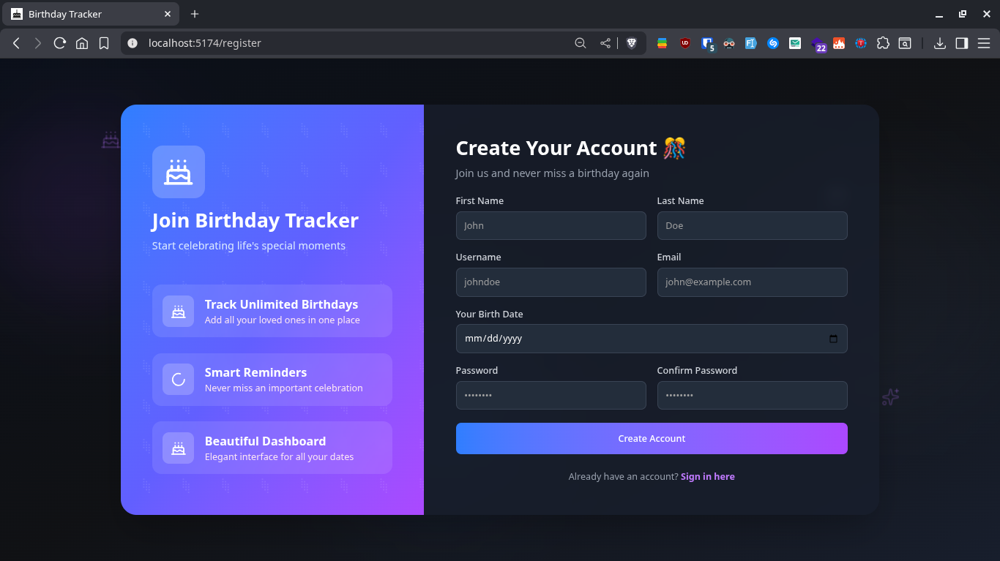
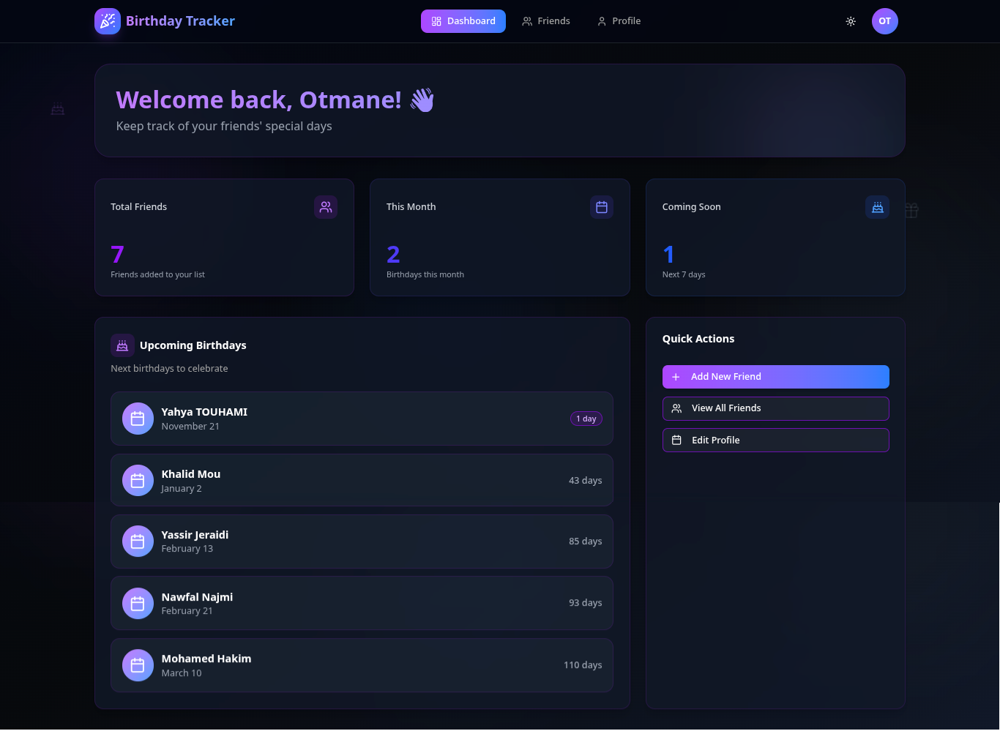
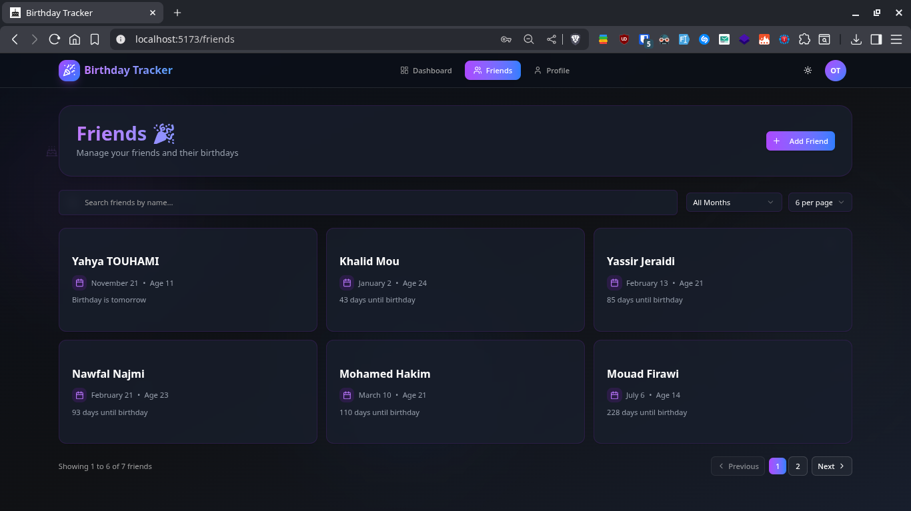
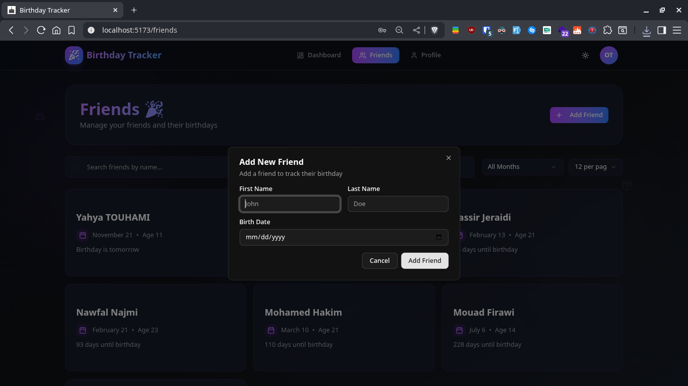
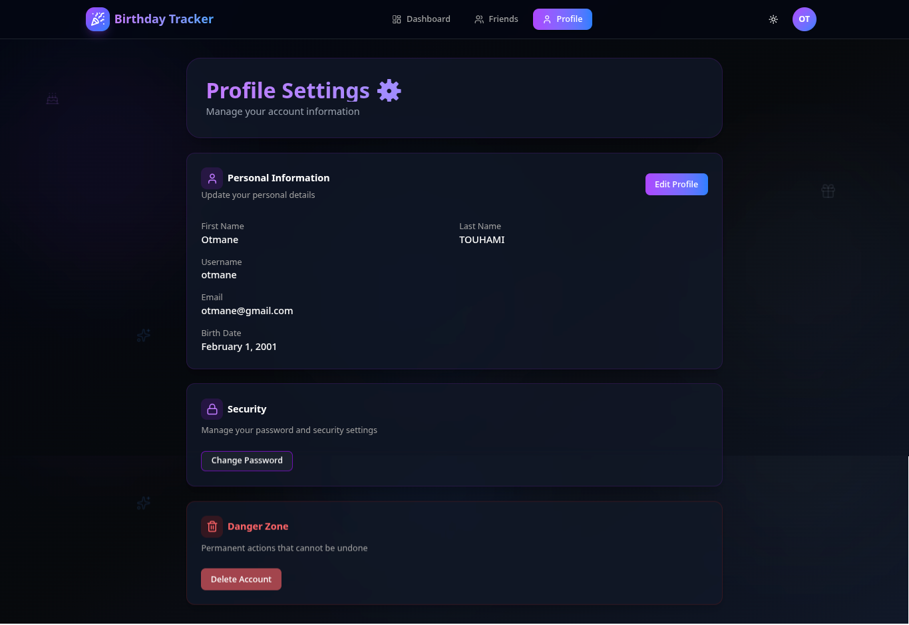

# 🎂 Birthday Tracker

A full-stack web application for tracking friends' birthdays and never missing important dates. Built with modern technologies including Quarkus, React, and MySQL.


## ✨ Features

- 🔐 **User Authentication** - Secure registration and login with JWT tokens
- 👥 **Friend Management** - Add, edit, and delete friends with their birthdays
- 📅 **Birthday Tracking** - View upcoming birthdays sorted by date
- 🎉 **Today's Birthdays** - Instantly see who has a birthday today
- 👤 **Profile Management** - Update your profile and change password
- 🎨 **Modern UI** - Clean and responsive interface with dark/light theme
- 🔒 **Secure** - Password hashing, JWT authentication, and protected routes

## 📸 Screenshots

### Authentication



_Secure login and registration with JWT authentication_

### Dashboard


_View upcoming birthdays at a glance with countdown to each celebration_

### Friends Management


_Manage all your friends' birthdays in one place_

### Add Friend


_Easily add new friends with their birthday information_

### User Profile


_Manage your account settings and personal information_

## 🏗️ Architecture

```
birthday-tracker/
├── backend/           # Quarkus REST API (Java 21)
│   ├── src/
│   ├── pom.xml
│   └── README.md
├── frontend/          # React TypeScript (Vite)
│   ├── src/
│   ├── package.json
│   └── README.md
└── README.md         # This file
```

## 🛠️ Technology Stack

### Backend

- **Framework**: Quarkus 3.29.3 (Java 21)
- **Database**: MySQL 8.0+
- **ORM**: Hibernate ORM with Panache
- **Security**: JWT (SmallRye JWT), BCrypt password hashing
- **API Documentation**: OpenAPI/Swagger UI
- **Build Tool**: Maven 3.9+

### Frontend

- **Framework**: React 19.2.0 with TypeScript 5.9.3
- **Build Tool**: Vite 7.2.2
- **Styling**: Tailwind CSS 4.1.17 + shadcn/ui components
- **State Management**: TanStack Query 5.90.10 + React Context
- **Forms**: React Hook Form + Zod validation
- **HTTP Client**: Axios 1.13.2
- **Routing**: React Router 7.2.2

## 📋 Prerequisites

Before you begin, ensure you have the following installed:

### Required

- **Node.js 18+** - [Download](https://nodejs.org/)
- **pnpm** - Install with: `npm install -g pnpm`
- **Java 21** - [Download OpenJDK](https://adoptium.net/)
- **Maven 3.9+** - [Download Maven](https://maven.apache.org/download.cgi)
- **MySQL 8.0+** - [Download MySQL](https://dev.mysql.com/downloads/)

### Verify Installations

```bash
node --version        # Should be 18 or higher
pnpm --version        # Should be 8 or higher
java -version         # Should be 21
mvn -version          # Should be 3.9 or higher
mysql --version       # Should be 8.0 or higher
```

## 🚀 Complete Setup Guide

Follow these steps to get the entire application running on your machine:

### Step 1: Clone the Repository

```bash
git clone https://github.com/OtmaneTouhami/birthday-tracker
cd birthday-tracker
```

### Step 2: Database Setup

1. **Start MySQL** (if not already running):

```bash
# On Linux/Mac
sudo systemctl start mysql
# or
sudo service mysql start

# On Windows (run as Administrator)
net start MySQL80
```

2. **Create the database and user**:

```bash
mysql -u root -p
```

Run these SQL commands:

```sql
CREATE DATABASE birthdaytracker_db;
CREATE USER 'birthdayuser'@'localhost' IDENTIFIED BY 'your_secure_password';
GRANT ALL PRIVILEGES ON birthdaytracker_db.* TO 'birthdayuser'@'localhost';
FLUSH PRIVILEGES;
EXIT;
```

### Step 3: Backend Configuration

1. **Navigate to backend directory**:

```bash
cd backend
```

2. **Create environment file**:

```bash
cp .env.exemple .env
```

3. **Edit `.env` file** with your configuration:

```bash
# Database Configuration
DB_KIND=mysql
DB_USERNAME=birthdayuser
DB_PASSWORD=your_secure_password
DB_URL=jdbc:mysql://localhost:3306/birthdaytracker_db?createDatabaseIfNotExist=true

# JWT Configuration (generate secure key with: openssl rand -base64 64)
JWT_ISSUER=birthday-tracker
JWT_SIGN_KEY=your-very-secure-random-key-at-least-256-bits-long

# Application Configuration
LOG_SQL=true

# CORS Configuration (add your frontend URL)
CORS_ORIGINS=http://localhost:5173,http://localhost:3000
```

4. **Generate JWT signing key** (recommended):

```bash
openssl rand -base64 64
```

Copy the output and paste it as the `JWT_SIGN_KEY` value in `.env`.

### Step 4: Frontend Configuration

1. **Navigate to frontend directory**:

```bash
cd ../frontend
```

2. **Install dependencies**:

```bash
pnpm install
```

3. **Create environment file**:

```bash
cp .env.example .env
```

4. **Edit `.env` file** (usually the default is fine):

```bash
VITE_API_BASE_URL=http://localhost:8080/api
```

### Step 5: Start the Backend

1. **Navigate to backend directory**:

```bash
cd ../backend
```

2. **Run in development mode**:

```bash
./mvnw quarkus:dev
```

**Wait for the message**: `Listening on: http://localhost:8080`

The backend will:

- Start on port 8080
- Automatically create database tables
- Enable live reload for development
- Make Swagger UI available at `http://localhost:8080/q/swagger-ui`

### Step 6: Start the Frontend

1. **Open a new terminal** (keep backend running)

2. **Navigate to frontend directory**:

```bash
cd frontend
```

3. **Start development server**:

```bash
pnpm dev
```

**Wait for the message**: `Local: http://localhost:5173/`

The frontend will:

- Start on port 5173
- Enable hot module replacement (HMR)
- Automatically open in your browser

### Step 7: Access the Application

🎉 **Your application is now running!**

- **Frontend**: http://localhost:5173
- **Backend API**: http://localhost:8080/api
- **Swagger UI**: http://localhost:8080/q/swagger-ui
- **Health Check**: http://localhost:8080/q/health

### Step 8: Create Your First Account

1. Open http://localhost:5173
2. Click **"Sign up"** or navigate to the register page
3. Fill in your details:
   - Username
   - Email
   - Password (min 8 chars, with uppercase, lowercase, digit, special char)
   - First Name
   - Last Name
   - Birth Date
4. Click **"Create Account"**
5. You'll be automatically logged in!

### Step 9: Add Your First Friend

1. Navigate to **"Friends"** page
2. Click **"Add Friend"**
3. Enter friend's details:
   - First Name
   - Last Name
   - Birth Date
4. Click **"Add Friend"**
5. See upcoming birthdays automatically calculated!

## 📖 Quick Reference

### Backend Commands

```bash
cd backend

# Development mode (with live reload)
./mvnw quarkus:dev

# Run tests
./mvnw test

# Package for production
./mvnw clean package

# Run production build
java -jar target/quarkus-app/quarkus-run.jar
```

### Frontend Commands

```bash
cd frontend

# Install dependencies
pnpm install

# Development server
pnpm dev

# Type checking
pnpm type-check

# Linting
pnpm lint

# Build for production
pnpm build

# Preview production build
pnpm preview
```

### MySQL Commands

```bash
# Connect to database
mysql -u birthdayuser -p birthdaytracker_db

# Show tables
SHOW TABLES;

# View users
SELECT * FROM User;

# View friends
SELECT * FROM Friend;

# Drop database (careful!)
DROP DATABASE birthdaytracker_db;
```

## 🔌 API Endpoints

### Authentication (Public)

- `POST /api/auth/register` - Register new user
- `POST /api/auth/login` - Login and get JWT token

### Friends (Protected)

- `GET /api/friends` - Get all friends
- `GET /api/friends/upcoming` - Get upcoming birthdays (sorted)
- `POST /api/friends` - Create new friend
- `PUT /api/friends/{id}` - Update friend
- `DELETE /api/friends/{id}` - Delete friend

### Profile (Protected)

- `GET /api/me` - Get user profile
- `PUT /api/me` - Update profile
- `PATCH /api/me/password` - Change password
- `DELETE /api/me` - Delete account

**Full API documentation**: http://localhost:8080/q/swagger-ui

## 🎨 Frontend Pages

- **`/`** - Dashboard with upcoming birthdays
- **`/login`** - Login page
- **`/register`** - Registration page
- **`/friends`** - Friend management
- **`/profile`** - User profile settings

## 🔐 Security Features

- **Password Hashing**: BCrypt algorithm with salt
- **JWT Authentication**: RS256 signed tokens, 24-hour expiration
- **Protected Routes**: Frontend and backend route guards
- **CORS Configuration**: Configured allowed origins
- **Input Validation**: Both client and server-side validation
- **SQL Injection Protection**: Parameterized queries via Hibernate

## 🐛 Troubleshooting

### Backend won't start

**Issue**: Port 8080 already in use

```bash
# Find what's using port 8080
sudo lsof -i :8080

# Kill the process
kill -9 <PID>
```

**Issue**: Database connection failed

```bash
# Check MySQL is running
sudo systemctl status mysql

# Verify credentials
mysql -u birthdayuser -p birthdaytracker_db

# Check .env file has correct credentials
```

### Frontend won't start

**Issue**: Port 5173 already in use

```bash
# Kill process on port 5173
sudo lsof -i :5173
kill -9 <PID>
```

**Issue**: Dependencies not installed

```bash
cd frontend
rm -rf node_modules pnpm-lock.yaml
pnpm install
```

### CORS Errors

**Issue**: Frontend can't reach backend

```bash
# Check backend CORS_ORIGINS in .env includes frontend URL
CORS_ORIGINS=http://localhost:5173

# Restart backend after changing .env
```

### JWT Token Invalid

**Issue**: Authentication fails

```bash
# Regenerate JWT_SIGN_KEY
openssl rand -base64 64

# Update .env with new key
# Restart backend
# Login again to get new token
```

## 📂 Project Structure

### Backend Structure

```
backend/src/main/java/com/krills/
├── dto/              # Data Transfer Objects
├── entity/           # JPA Entities (User, Friend)
├── repository/       # Data Access Layer
├── service/          # Business Logic
├── resource/         # REST Controllers
├── mapper/           # Entity-DTO Mappers
├── validation/       # Custom Validators
└── exception/        # Exception Handling
```

### Frontend Structure

```
frontend/src/
├── components/       # React Components
│   ├── auth/        # Login, Register forms
│   ├── friends/     # Friend management components
│   ├── layout/      # Navbar, Layout wrapper
│   └── ui/          # shadcn/ui components
├── context/         # React Context (Auth, Theme)
├── hooks/           # Custom React hooks
├── pages/           # Page components
├── routes/          # Route configuration
├── services/        # API client services
├── types/           # TypeScript type definitions
└── utils/           # Utility functions
```

## 🧪 Testing

### Backend Tests

```bash
cd backend
./mvnw test
./mvnw verify  # With coverage
```

### Frontend Tests

```bash
cd frontend
pnpm test
```

## 📦 Building for Production

### Backend

```bash
cd backend
./mvnw clean package
java -jar target/quarkus-app/quarkus-run.jar
```

### Frontend

```bash
cd frontend
pnpm build
pnpm preview  # Test production build locally
```

The production build will be in `frontend/dist/` and can be deployed to any static hosting service.

## 🚢 Deployment

### Backend Deployment Options

- Traditional Java hosting (Tomcat, WildFly)
- Cloud platforms (AWS, Google Cloud, Azure)
- Container platforms (Kubernetes, OpenShift)
- Serverless (AWS Lambda with Quarkus)

### Frontend Deployment Options

- Vercel (recommended for Vite apps)
- Netlify
- GitHub Pages
- AWS S3 + CloudFront
- Any static file hosting

### Database Deployment

- Managed MySQL (AWS RDS, Google Cloud SQL)
- Self-hosted MySQL
- MariaDB (compatible alternative)

## 📚 Additional Documentation

- **Backend README**: [backend/README.md](backend/README.md) - Detailed API documentation
- **Frontend README**: [frontend/README.md](frontend/README.md) - Component documentation
- **Quarkus Guides**: https://quarkus.io/guides/
- **React Documentation**: https://react.dev/

## 🤝 Contributing

Contributions are welcome! Please follow these steps:

1. Fork the repository
2. Create a feature branch (`git checkout -b feature/amazing-feature`)
3. Commit your changes (`git commit -m 'Add amazing feature'`)
4. Push to the branch (`git push origin feature/amazing-feature`)
5. Open a Pull Request

## 📄 License

This project is licensed under the MIT License.

## 👨‍💻 Author

**Otmane Touhami**

- GitHub: [@OtmaneTouhami](https://github.com/OtmaneTouhami)

## 🙏 Acknowledgments

- Built with [Quarkus](https://quarkus.io/) - Supersonic Subatomic Java
- UI components from [shadcn/ui](https://ui.shadcn.com/)
- Icons from [Lucide](https://lucide.dev/)
- Styled with [Tailwind CSS](https://tailwindcss.com/)

---

**Happy Birthday Tracking! 🎉🎂🎈**
